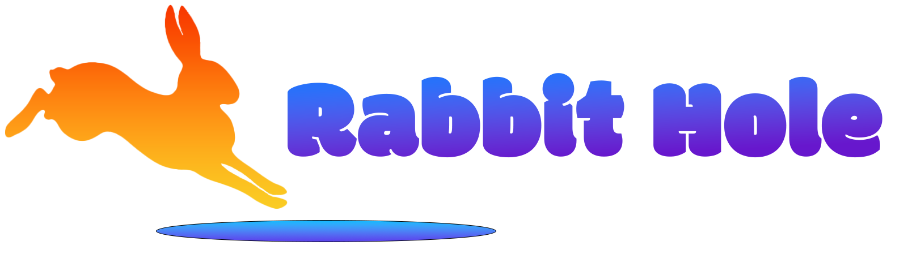

# Rabbit Hole

# Background

Rabbit Hole is a social media application where users can post about the topics that interest them and be served fascinating content tailored to them based on the topics they have viewed and liked in the past.  

# Getting Started

# [Check out Rabbit Hole Here](https://rabbity-hole.netlify.app)

Planning materials can be found [here](https://trello.com/b/MdLfbcU6/rabbit-kanban).

# Technologies used
* TypeScript
* PostgreSQL / Supabase
* Sequelize
* Express
* React
* Node.js
* Vite
* JWT Authentication
* JavaScript
* HTML
* CSS
* Photoshop
* Git

# Attributions
My sincere thanks to the creators who have made their content available to be freely used by developers.

Rabbit Hole makes use of the font Schibsted Grotesk designed by Bakken & Bæck, Henrik Kongsvoll and made available through Google fonts.  It can be accessed at [google fonts](https://fonts.google.com/specimen/Schibsted+Grotesk?query=schibsted+grotesk).

Rabbit Hole uses a SVG icons made available by icons8.com and svgrepo.com

# Ice Box
- Optimize design for mobile devices
- Implement Photo/Video upload capability
- Track viewed and liked content
- Implement algorithm to 